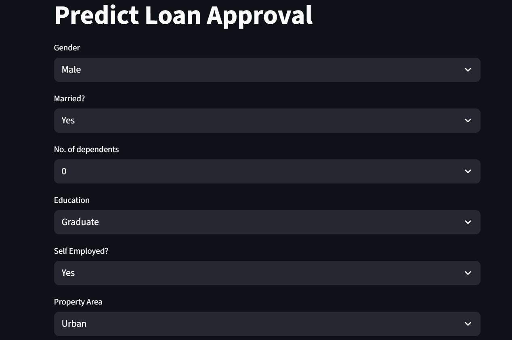

# 🏦 Loan Status Predictor

This Streamlit app predicts whether a loan application will be approved based on financial and personal information using a machine learning model.

---

## 🔍 Features

- 📊 Data Visualization (correlation heatmap, pie chart of loan status)
- 🔮 Prediction tool using trained Logistic Regression model
- 📈 Model performance: Confusion Matrix & Classification Report

---

## 📂 Dataset  
**Source:** [Kaggle - Loan Prediction Dataset](https://www.kaggle.com/altruistdelhite04/loan-prediction-problem-dataset)

---

## 🧠 Model Info

- **Trained on:** Cleaned and encoded applicant data (Gender, Education, Income, Credit History, etc.)
- **Model:** Logistic Regression  
- **Preprocessing:** Label Encoding for categorical values, Standard Scaler for numerical features  
- **Evaluation:** Classification Report (Precision, Recall, F1-Score)

---

## 🚀 Tech Stack

Python, Streamlit, scikit-learn, pandas, seaborn, matplotlib

---

## 📎 Demo

🔗 **Live App**: [https://predict-loanapproval.streamlit.app/]

---

## 📸 Screenshots

---

## 📜 License

This project is licensed under the MIT License – see the LICENSE file for details.

---

## 🙋 Author

Built with ❤️ by **Laksh Arora**

- 🔗 [GitHub Profile](https://github.com/lakshhttps)
- 💼 [LinkedIn](https://www.linkedin.com/in/laksh-arora-490ba725b/)
- 🐦 [X (Twitter)](https://x.com/hacknhash)
